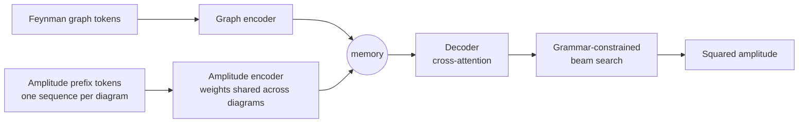
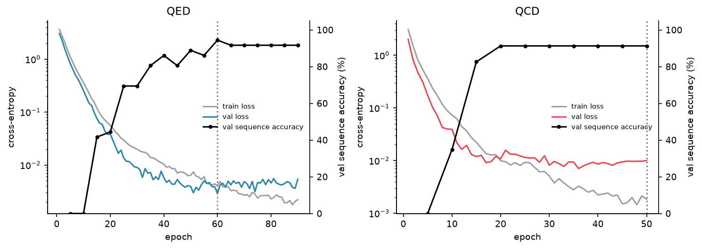
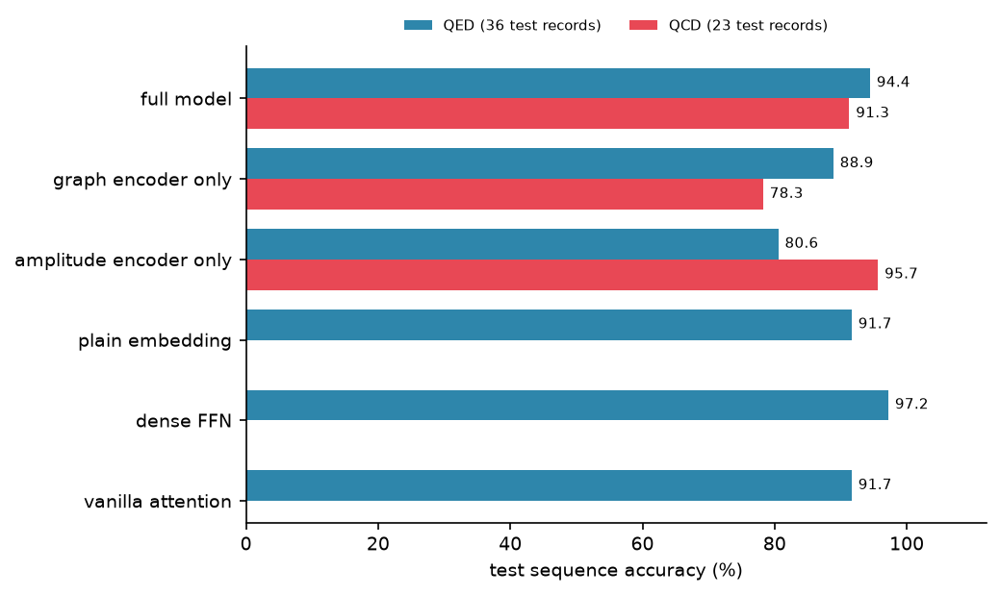
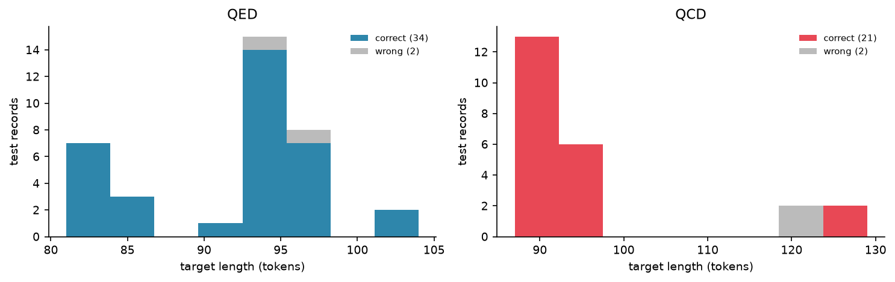
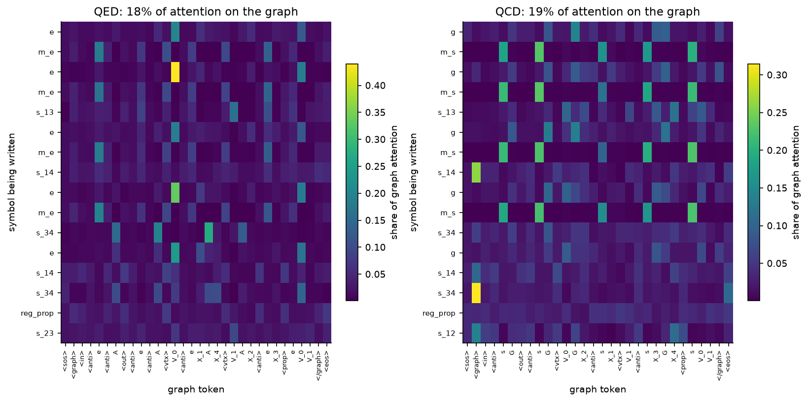
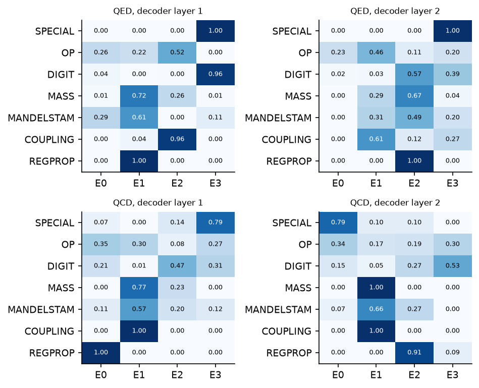

# Squared Amplitudes with Transformers

Predicting the squared amplitude $\overline{|\mathcal{M}|^2}$ of a particle
collision from its Feynman diagram and amplitude, for tree-level 2 → 2
processes in QED and QCD.

## Overview

Every cross section starts from a squared amplitude: the amplitude
$\mathcal{M}$ times its complex conjugate, summed over the spins and colours
that are not observed. Computer algebra does this exactly, but the cost grows
quickly: squaring a sum of $d$ Feynman diagrams gives $d^2$ interference
terms, each with its own Dirac traces and colour factors.

This project learns the map from amplitude to squared amplitude with a
sequence-to-sequence transformer. The model is built around the structure of
its inputs rather than their characters:

- dummy indices are renamed and the amplitude is parsed into a syntax tree,
  written in prefix notation;
- the Feynman diagram gets its own encoder, next to the amplitude encoder;
- tokens use role-filler embeddings, encoder attention is exclusive
  self-attention, and every feed-forward layer is a mixture of experts;
- the target is the squared amplitude in canonical form, and decoding is
  constrained so that every output is a valid expression.

## Dataset

The SYMBA dataset, generated with [MARTY](https://marty.in2p3.fr/): 360 QED and
234 QCD tree-level 2 → 2 processes. Each line of `data/Symba/{QED,QCD}/*.txt`
holds one process:

```
interaction : vertices : amplitude : squared amplitude
```

| | QED | QCD |
|---|---|---|
| records | 360 | 234 |
| train / val / test | 288 / 36 / 36 | 188 / 23 / 23 |
| longest raw squared amplitude (characters) | 210 | 2,872 |
| longest canonical target (tokens) | 103 | 134 |
| longest amplitude (tokens) | 262 | 2,859 |
| longest single diagram (tokens) | 262 | 239 |
| target vocabulary | 37 | 34 |

## Preprocessing

Worked through for one QED record, $t\bar t \to e^+e^-$ through a photon
(`QED-2-to-2-diag-TreeLevel-2.txt`, line 1).

**1. Dummy indices.** MARTY numbers contracted indices arbitrarily. They are
renamed in order of appearance, so the same structure always gets the same
tokens:

```
gamma_{+%\tau_157,%gam_147,%eta_108}*gamma_{%\tau_157,%gam_148,%gam_149}*...
gamma_{+%\tau_d1,%gam_d2,%eta_d3}*gamma_{%\tau_d1,%gam_d4,%gam_d5}*...
```

**2. Amplitude → syntax tree.** A LALR grammar ([lark](https://github.com/lark-parser/lark))
parses the amplitude, and the tree is written in prefix (Polish) notation. No
brackets are needed and numbers are split into digits (126 tokens):

```
/ * * * * * * * * / NEG 1 2 i ^ e 2 _ gamma , , UADD _ %\tau d1 _ %gam d2 _ %eta d3 ...
```

**3. Feynman diagram → graph tokens.** External legs, the fields at each
vertex, and every propagator as an edge between two vertices:

```
<graph> <in> t <anti> t <out> e <anti> e <vtx> V_0 e X_3 <anti> e X_4
        <vtx> V_1 t X_1 <anti> t X_2 <prop> A V_0 V_1 </graph>
```

**4. Canonical target.** MARTY's squared amplitude is expanded, put over a
common denominator and cancelled with [sympy](https://www.sympy.org), so equal
answers are written identically, then serialised in prefix notation with typed
integer tokens (`INT+ 1 6` is 16):

```
raw        1/4*e^4*(16*m_e^2*m_t^2 + 8*m_e^2*s_12 + 8*s_14*s_23 + 8*s_13*s_24 + 8*m_t^2*s_34)*(m_t^2 + s_12 + 1/2*reg_prop)^(-2)
canonical  (16 e^4 m_e^2 m_t^2 + 8 e^4 m_e^2 s_12 + 8 e^4 m_t^2 s_34 + 8 e^4 s_13 s_24 + 8 e^4 s_14 s_23) / (2 m_t^2 + reg_prop + 2 s_12)^2
tokens     / + * INT+ 1 6 * ^ e INT+ 4 * ^ m_e INT+ 2 ^ m_t INT+ 2 + * INT+ 8 * ^ e INT+ 4 ...
```

**5. One sequence per diagram (QCD).** QCD amplitudes reach 2,859 tokens. They
are split at the sum over diagrams and each diagram, at most 239 tokens, is
encoded separately with shared weights. The decoder then attends over all of
them at once. QED amplitudes are short enough to encode whole.

Nothing is truncated: every sequence is used at full length.

## Model



| component | choice |
|---|---|
| embedding | role-filler, $C(A\,f + B\,r)$: filler $f$ = token + grammar type, role $r$ = position |
| encoder self-attention | exclusive self-attention (XSA): the output is projected off the token's own value vector |
| feed-forward | mixture of 4 experts, top-2 routing, load-balancing loss |
| decoder | causal self-attention, cross-attention over both encoders, output layer tied to the embedding |
| decoding | beam width 4, length-normalised; tokens that cannot continue a valid expression are masked |
| size | $d_\text{model}$ = 128, 4 heads, 2 layers per encoder and decoder, FFN width 512; 3.9 M parameters |

## Training

| | |
|---|---|
| split | random 80 / 10 / 10 of the records, seed 42 |
| optimiser | AdamW, learning rate 3e-4, weight decay 0.01, 10% linear warmup then cosine decay |
| epochs, batch size | up to 120 and 16 for QED; up to 60 and 4 for QCD |
| model selection | best greedy sequence accuracy on the validation set, checked every 5 epochs |
| hardware | laptop CPU (Intel Core i7-1355U), no GPU, three runs in parallel |

Metrics, all on the test set:

- **token accuracy**: next-token accuracy with the true prefix given (teacher forcing);
- **sequence accuracy**: the decoded output equals the canonical target token for token;
- **symbolic accuracy**: the decoded output equals the target as a function,
  checked by exact evaluation at random rational points;
- **valid expressions**: share of outputs that parse.

## Results

Every number below is read from `results/*.json` by `scripts/plot_results.py`,
which also draws the figures.

| | QED | QCD |
|---|---|---|
| test records | 36 | 23 |
| token accuracy (%) | 99.9 | 99.9 |
| **sequence accuracy (%)** | **94.4** | **91.3** |
| symbolic accuracy (%) | 94.4 | 91.3 |
| sequence accuracy, greedy decoding (%) | 94.4 | 91.3 |
| valid expressions (%) | 100.0 | 100.0 |
| parameters | 3,920,000 | 3,934,592 |
| selected epoch | 60 | 50 |
| seconds per epoch (CPU, median) | 36 | 85 |

The model writes the exact squared amplitude for 34 of 36 QED and 21 of 23 QCD
test processes, and every output it produces is a valid expression. Beam search
and greedy decoding reach the same accuracy.

### Training



Loss on a log scale, validation sequence accuracy on the right axis; the dotted
line marks the selected checkpoint, the one with the best validation sequence
accuracy. Training stops after 30 epochs without improvement.

### Ablations

Each variant takes one component out of the full model and is trained and
tested on the same split.

| model | QED | QCD |
|---|---|---|
| full model | 94.4 | 91.3 |
| graph encoder only | 88.9 | 78.3 |
| amplitude encoder only | 80.6 | 95.7 |
| plain embedding (no role-filler) | 91.7 | - |
| dense FFN (no MoE) | 97.2 | - |
| vanilla attention (no XSA) | 91.7 | - |



- **Both encoders matter, differently in each theory.** Without the amplitude
  encoder QCD falls from 91.3% to 78.3%; without the graph encoder QED falls
  from 94.4% to 80.6%. The QCD amplitude-only model is one test record above
  the full model.
- **Role-filler embedding, MoE and XSA** were ablated on QED, where a run is
  four times cheaper. Each variant lands within one test record of the full
  model, and one record is 2.8 points on 36 records, so on a dataset this size
  none of the three changes accuracy measurably.

### Errors



Both QED errors get the whole structure right and pair the masses with the
wrong Mandelstam variables (`QED-2-to-2-diag-TreeLevel-8.txt`, line 3):

```
predicted  (16 e^4 m_b^2 m_t^2 + 8 e^4 m_b^2 s_12 + 8 e^4 m_t^2 s_34 + 8 e^4 s_13 s_24 + 8 e^4 s_14 s_23) / (9 (2 m_b^2 + reg_prop + 2 s_12)^2)
truth      (16 e^4 m_b^2 m_t^2 + 8 e^4 m_b^2 s_34 + 8 e^4 m_t^2 s_12 + 8 e^4 s_13 s_24 + 8 e^4 s_14 s_23) / (9 (2 m_b^2 + reg_prop + 2 s_12)^2)
```

Both QCD errors come from `QCD-2-to-2-diag-TreeLevel-6.txt`, with 123-token
targets, among the longest in the test set; there the model writes a different
polynomial altogether.

### What the decoder looks at



Last-layer cross-attention onto the graph tokens, averaged over heads, while
the decoder writes each physical symbol of the answer (test record with the
shortest target). About a fifth of the attention goes to the graph and the rest
to the amplitude. When it writes a mass, the decoder looks at the legs and
vertex fields of that particle: every `m_s` row in QCD lights up on the
s-quark tokens, every `m_e` row in QED on the electron tokens.

### How the experts split the work



Share of each token type that a decoder layer sends to each of its four
experts (top-1), over the test set. Routing is far from uniform: in QED's first
decoder layer `reg_prop` always goes to expert E1, the coupling `e` to E2 in
96% of cases and digits to E3 in 96%.

## Repository structure

```
symba-amplitudes/
├── data/Symba/{QED,QCD}/       the corpus, one process per line
├── symba/
│   ├── config.py               every hyperparameter
│   ├── data/
│   │   ├── load.py             read the corpus
│   │   ├── normalize.py        dummy-index renaming
│   │   ├── ast_parse.py        amplitude -> prefix syntax tree, split per diagram
│   │   ├── graph.py            Feynman diagram -> graph tokens
│   │   ├── canonical.py        canonical squared amplitude
│   │   ├── serialize.py        canonical target <-> prefix tokens
│   │   ├── vocab.py            token <-> id
│   │   └── dataset.py          preprocessing, split, data loaders
│   ├── model/
│   │   ├── embed.py            role-filler embedding
│   │   ├── attention.py        multi-head attention with XSA
│   │   ├── ffn.py              mixture of experts
│   │   └── model.py            encoders and decoder
│   ├── decode.py               grammar-constrained beam search
│   ├── metrics.py              symbolic equality
│   ├── trainer.py              training loop and evaluation
│   └── predictor.py            checkpoints and inference
├── scripts/
│   ├── train.py                train and evaluate one model
│   ├── run_all.sh              every run in the results tables
│   ├── plot_results.py         figures and tables
│   └── predict.py              predict with a trained model
├── tests/test_pipeline.py
└── results/                    one JSON per run, and figures/
```

## Usage

```bash
pip install -r requirements.txt
python tests/test_pipeline.py
```

Train and evaluate one model. `--variant` is `full` or an ablation
(`graph_only`, `ast_only`, `no_role_filler`, `no_moe`, `no_xsa`); results go to
`results/<theory>_<variant>.json` and the weights to `checkpoints/`.

```bash
python scripts/train.py --theory QED
python scripts/train.py --theory QCD --variant ast_only
```

Reproduce every number and figure in this README:

```bash
bash scripts/run_all.sh
```

Predict squared amplitudes with a trained model:

```bash
python scripts/predict.py checkpoints/QED_full.pt data/Symba/QED/QED-2-to-2-diag-TreeLevel-2.txt --limit 3
```

## License

MIT — see [LICENSE](LICENSE).
